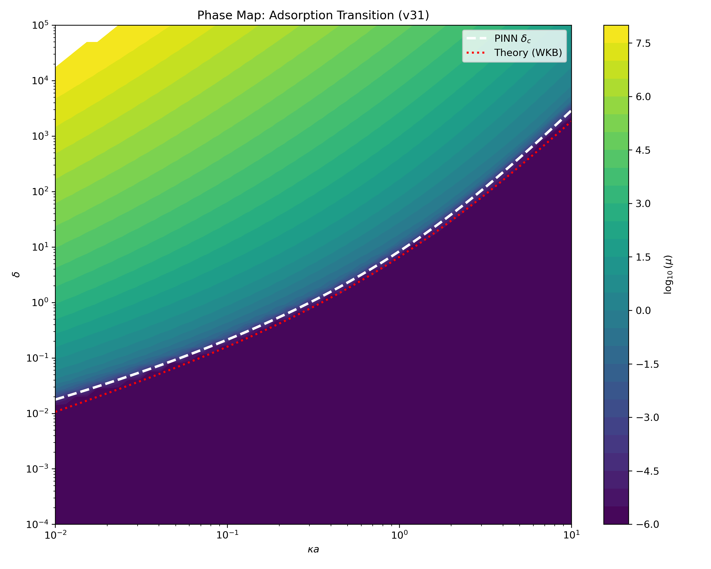

# PINN-s (Parametric PINNs for Polymer Physics)

> **Primeira Etapa do Projeto de Mestrado** 
> *Modelagem de Polímeros em Superfícies de Carga Homogênea usando Redes Neurais Informadas pela Física (PINNs)*

## Sobre o Projeto
Este repositório contém a versão **v31** do nosso modelo de Física Informada por Redes Neurais (PINN Paramétrica). Esta etapa da pesquisa focou em resolver a **Equação de Edwards** não-linear para mapear o comportamento termodinâmico de cadeias poliméricas ao redor de macro-íons (proteínas/nanopartículas) que possuem uma **superfície de carga homogênea**.

O grande diferencial deste modelo é a sua capacidade de generalização paramétrica: em vez de treinar a rede para uma única configuração de solvente ou salinidade, a PINN v31 aprendeu a solução contínua de todo o **Espaço de Fase**.

### O Espaço de Fase e a Transição de Adsorção
Usando a rede v31, nós conseguimos calcular e extrair as curvas críticas de transição de fase, mapeando o **Parâmetro de Adsorção** ($u_{rel}$ ou $u$) contra o **Parâmetro de Blindagem Eletrostática** ($\kappa \times a$).

Isso nos permitiu identificar exatamente as fronteiras termodinâmicas onde o polímero transiciona do estado _Coil_ (desenovelado/solvatação) para o estado de _Adsorção_ na superfície da macromolécula, dependendo da força iônica do solvente e da afinidade da superfície.

## Estrutura do Repositório
* `/scripts/`: 
  * `unified_pinn_edwards_v31.py`: Código-fonte principal da PINN Paramétrica V31, contendo a formulação da loss de resíduo físico da Equação de Edwards e as lógicas de treinamento otimizado (L-BFGS).
  * `plot_phase_map_v31.py`: Script numérico para varrer o domínio paramétrico da rede treinada e extrair a matriz do Espaço de Fase de adsorção.
* `/images/`:
  * `phase_map_v31.png`: O mapa termodinâmico de transição extraído pela rede neural! (Parâmetro de Adsorção vs $\kappa \times a$).
  * Outras predições estruturais de densidade polimérica para configurações pontuais.

## Demonstração (Mapa de Fase)
O mapa de fase extraído pela PINN parametrizada ilustrando a transição do polímero:

---
*Física Estatística de Polímeros informada por Machine Learning.*
